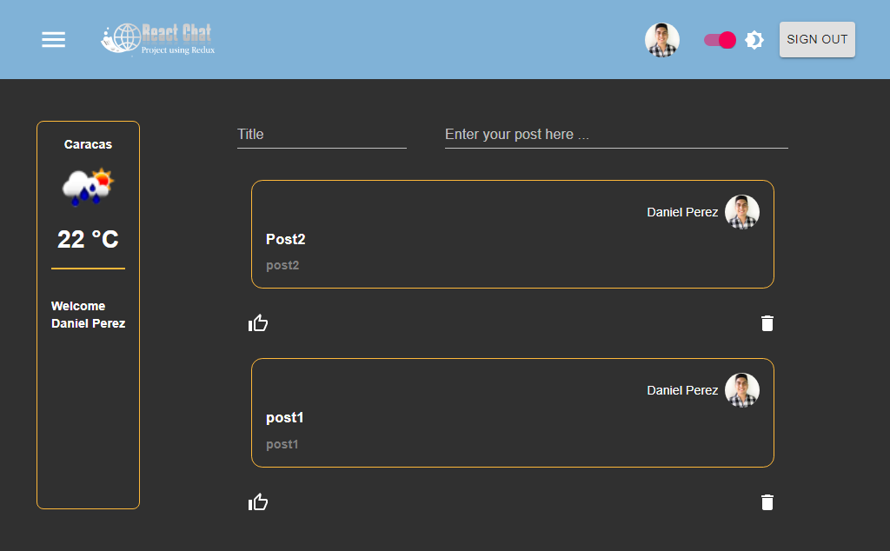

# Sala de Chat

### Proyecto Práctico usando ReactJs

###### La aplicación consiste en iniciar sesión por medio de una cuenta de correo en Google, para posteriormente entrar en una sala de Chat donde puedas escribir un comentario, el cual mostrará el contenido del post, el nombre del usuario y el avatar que utiliza como imagen. Asimismo, se muestra un boton que permite borrar el cometario.

###### El Post escrito se guarda en la aplicación, de manera que si el usuario cierra sesión, su comentario no se elimina.

###### En la parte superior del proyecto, se encuentra un botón de menu que permite traer un Sidebar en donde se puede ver el Estado del Clima de la ciudad donde el usuario se encuentra. Así como también un boton para colocar la aplicación en Modo Oscuro

###### El objetivo de este proyecto práctico fue implementar una Base de Datos para registrar los usuarios que ingresan a la aplicación, almacenar el Post escrito por dicho usuario y borrarlo desde la app

###### Para ello se hizo uso de _Firebase_ que permite crear una base de datos gratuita.

###### Para traer los datos del clima se hizo un llamado a la API de _openweathermap_
[Sitio web del API](https://openweathermap.org)

###### Para Estilizar el contenido se uso la librería de _MaterialUI_

###### Para manejar los eventos se creó un archivo llamado *reducer* que guardar los estados de las variables, para saber si el usuario inicio sesión y así poder ingresar a la aplicación de Post. Además se implemento para manejar el cambio de Tema a modo Oscuro por medio de la opción de createTheme que provee Material UI.

